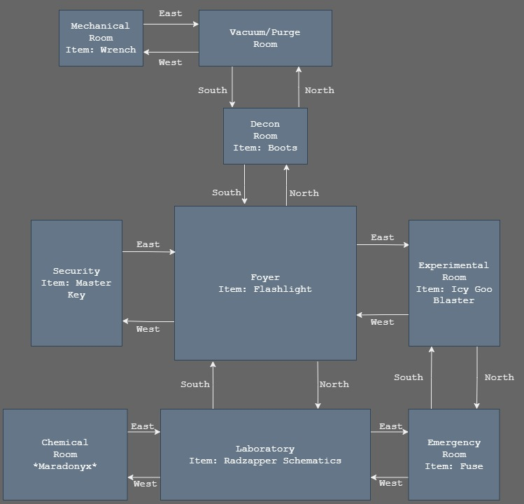

# Vault 166: Text-Based Survival Game

Create a game where players must survive in a
hostile environment, such as a post-apocalyptic world or a
deserted island, by managing resources, crafting tools, and
making critical choices.

Note: This project began as a simple, monolithic prototype. The baseline version represents the initial working implementation prior to any structural refactoring.

## Storyboard

### Theme and Basic Storyline

Survival

In a nuclear wasteland, you are the first
wanderer to come across Vault 166 which has been sealed for
over 50 years. Vault 166 was used for experimental research
of weapons, tools and other resources. There has been claims
of a machine that removes all radiation and can shield
a city within it. Explore the vault, find the schematics and
escape before the oxygen depletes... or worse!

### Rooms

1. Vacuum/Purge Room
2. Decontamination Room
3. Foyer
4. Mechanical Room
5. Security
6. Experimental Room
7. Chemical Room
8. Laboratory
9. Emergency Room

### Items

1. Blaster
2. Key
3. Boots
4. Flashlight
5. Wrench
6. Batteries
7. Schematics

### Villain

Maradonyx

The reason for Vault 166 to be abandoned lies inside. A terrible
experiment gone wrong, Maradonyx is an unbreakable gem fusion
with the radiation keeping it alive.

Strengths:

- Radiation Shine
- Charge Attack

Weaknesses:

- Ice
- Light

## Map Design

