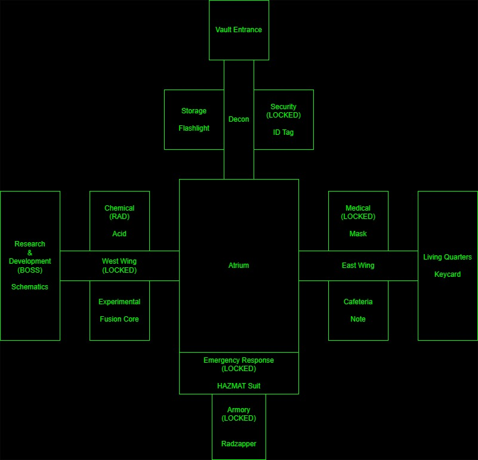

### Project Overview

Vault 166 is a text-based adventure game written in Python that emphasizes modular design, clear game flow, and rule-based decision making. The project was originally developed as a course assignment and has since been enhanced as part of a capstone project to better demonstrate software engineering principles, algorithmic thinking, and maintainable architecture.

Players explore a vault environment, collect critical items, survive environmental hazards, and ultimately confront a final threat. The game prioritizes clarity of interaction, predictable command handling, and readable output within a terminal interface.

### Key Features

- Text-based exploration with directional movement
- Centralized game loop with clear command dispatch
- Modular input parsing with command normalization
- Rule-based movement restrictions and hazard evaluation
- Inventory management using efficient data structures
- Optional in-game map and help commands
- Clean exit handling without relying on keyboard interruption

### Architecture Overview

The project is organized into distinct modules, each responsible for a specific aspect of the game:

- `game.py`: Controls the main game loop, command processing, and output flow
- `input_parser.py`: Normalizes and validates player input using tokenization, alias mapping, and prefix matching
- `rules.py`: Encapsulates gameplay rules such as hazards, locked areas, and boss conditions
- `map.py`: Builds the room graph and provides a static minimap reference
- `room.py`: Defines room state and properties
- `player.py`: Tracks player state including inventory and health
- `utils.py`: Handles shared output helpers and formatting
- `vault166.py`: Entry point for running the game

This separation allows gameplay rules and user interaction logic to evolve independently, improving maintainability and readability.

### Gameplay Flow

- The game begins in the Vault Entrance, displaying an initial room description.
- A status summary showing player and room information is displayed every turn.
- Full room descriptions are shown only when entering a room or at game start.
- Commands such as `map` and `help` provide information without disrupting player context.
- The game ends when the player exits, is defeated, or completes the final encounter.

### Running the Game

```bash
python vault166.py
```

### Controls

- `go <direction>`: Move in a direction (supports short and partial forms)
- `get <item>`: Pick up an item in the current room
- `map`: Display a compact vault map
- `help`: Display available commands
- `exit` or `quit`: End the game safely

## Map Design

The following map represents the intended layout and structure of Vault 166. It acts as a reference for world design and progression planning rather than a direct reflection of current gameplay.


