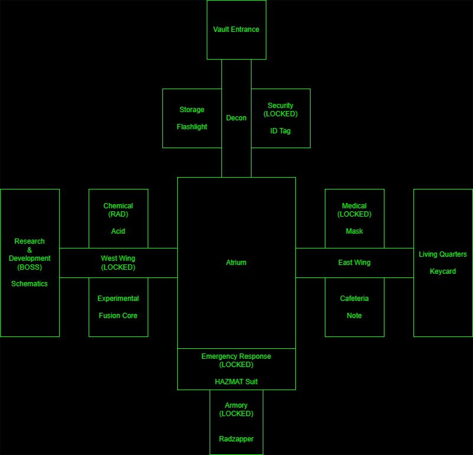

# Vault 166: Text-Based Survival Game

Text-based game where players must survive in a
hostile environment inside a vault by acquiring items and
making critical choices. Inspired by the Fallout series!

## Storyboard

### Theme and Basic Storyline

Genre: Survival

In a nuclear wasteland, you are the first
wanderer to come across Vault 166 which has been sealed for
over 50 years. Vault 166 was used for experimental research
of weapons, tools and other resources. There has been claims
of schematics for a weapon capable of removing all radiation.
Explore the vault, find the schematics andescape before the
oxygen depletes... or worse!

### Rooms

1. Vault Entrance
2. Decontamination Room
3. Storage Room
4. Security
5. Atrium
6. Experimental Room
7. Chemical Room
8. Laboratory
9. Medical Room
10.   Living Quarters
11.   Cafeteria
12.   Research & Development

### Items

TBD

### Villain

Maradonyx

The reason for Vault 166 to be abandoned lies inside. A terrible
experiment gone wrong, Maradonyx is an unbreakable gem fusion
with the radiation keeping it alive.

Strengths:

-  Radiation Shine
-  Charge Attack

Weaknesses:

-  Ice
-  Light

## Map Design

