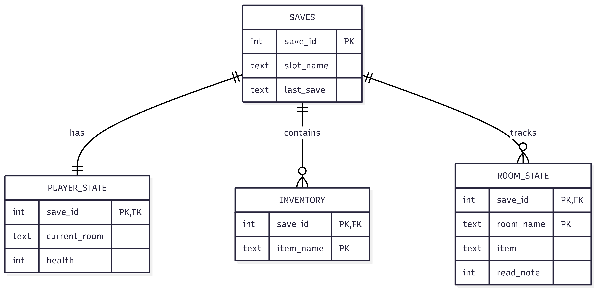

# Vault 166 Database Enhancement

This document describes the Database enhancement for the Vault 166 project. The goal of this enhancement was to introduce persistent storage using SQLite while maintaining the existing modular architecture and preserving the separation between static world definitions and dynamic runtime state.

Unlike earlier versions of the game, which stored all data in memory, this enhancement allows player progress to be saved and restored across sessions using named save slots.

## Design Focus

The database implementation was designed around the following principles:

- Store only runtime state that changes during gameplay
- Rebuild static world structure from code on startup
- Overlay saved state onto the reconstructed world
- Use relational constraints to preserve data integrity
- Support multiple independent save slots

Rather than serializing entire objects, the system persists only the mutable components of game state such as player location, health, inventory contents, and per-room state changes.

## Schema Overview

The database consists of four related tables:

- **SAVES**
- **PLAYER_STATE**
- **INVENTORY**
- **ROOM_STATE**

### SAVES

Stores metadata for each save slot.

- `save_id` (Primary Key)
- `slot_name`
- `last_save`

Each slot represents a complete snapshot of runtime state.

### PLAYER_STATE

Stores the player’s dynamic state for a given save.

- `save_id` (Primary Key, Foreign Key)
- `current_room`
- `health`

This table maintains a one-to-one relationship with `SAVES`.

### INVENTORY

Stores inventory items associated with a save.

- `save_id` (Primary Key, Foreign Key)
- `item_name` (Primary Key)

A composite primary key ensures that each item appears only once per save slot.

### ROOM_STATE

Stores mutable per-room data.

- `save_id` (Primary Key, Foreign Key)
- `room_name` (Primary Key)
- `item`
- `read_note`

Static properties such as room descriptions, hazards, connections, and darkness remain defined in code and are reconstructed each time the game starts.

Only mutable fields such as item presence and note-read status are persisted.

## Save Workflow

When the player issues a save command, the following steps occur:

1. The system resolves the slot name (defaulting to `"main"` if none is provided).
2. The database checks whether the slot already exists.
3. If the slot does not exist, it is created.
4. If it exists, the `last_save` timestamp is updated.
5. Player state is inserted or updated using an upsert strategy.
6. Existing inventory rows for that save are deleted and replaced with a fresh snapshot.
7. Existing room state rows for that save are deleted and replaced with a fresh snapshot.
8. The transaction is committed.

The delete-and-reinsert strategy ensures that stale data cannot persist between saves and keeps the logic simple and predictable.

## Load Workflow

When the player issues a load command, the following steps occur:

1. The system validates that the requested slot exists.
2. The associated `save_id` is retrieved.
3. Player state is loaded and validated.
4. The player’s location and health are restored.
5. Inventory is cleared and repopulated from stored rows.
6. Saved room state is overlaid onto the rebuilt map.
7. If any required data is missing or invalid, the load operation fails gracefully.

Because the world structure is reconstructed from code before applying saved state, the system preserves architectural integrity while restoring only mutable values.

## Validation and Integrity

The implementation includes:

- Foreign key constraints with cascading deletes
- Composite primary keys for uniqueness enforcement
- Slot existence validation during load
- Room existence validation before applying state
- Controlled inventory reset before repopulation

These measures prevent corrupted or inconsistent state from breaking gameplay.

## Benefits of This Approach

- Maintains separation of concerns between world definition and persistence
- Supports multiple independent save slots
- Uses normalized relational modeling
- Demonstrates applied database design principles
- Preserves modular architecture without restructuring core gameplay logic
